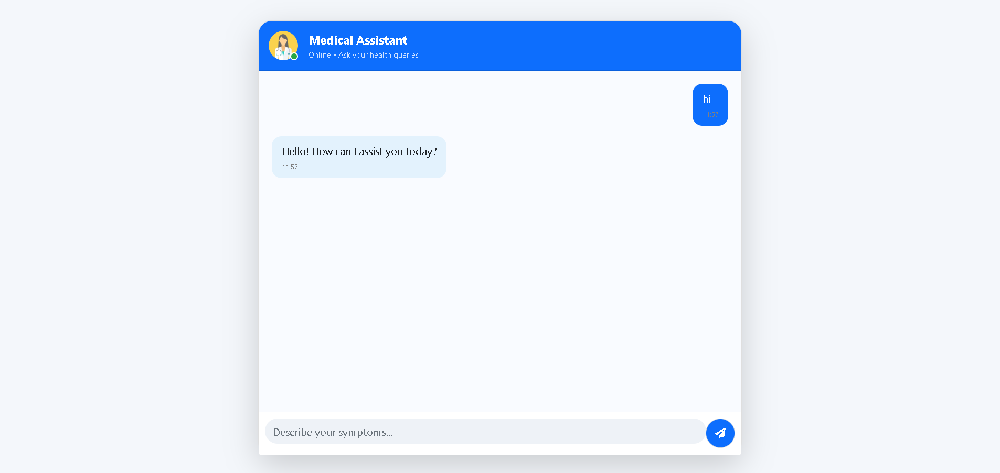

# 🏥 AI-Powered Medical Chatbot using RAG & LangChain

An intelligent **Retrieval-Augmented Generation (RAG)** based medical chatbot that provides accurate and context-aware responses using **LangChain, OpenAI, and Pinecone**. The system retrieves relevant medical knowledge and generates reliable answers, reducing hallucinations compared to traditional chatbots.

---

## 🚀 Features

* 🧠 RAG-based architecture for context-aware and accurate responses
* 🔍 Semantic search using vector embeddings (Pinecone)
* ⚡ Real-time chatbot using Flask and AJAX
* 📱 Fully responsive UI (mobile + desktop support)
* 💬 Interactive chat with typing indicator and auto-scroll
* 🧩 Clean and modern medical-themed UI

---

## 📸 Screenshots

### 💬 Chat Interface




---

## 🧠 System Architecture

User Query → Embedding → Vector Search (Pinecone) → Context Retrieval → LLM (OpenAI) → Response

---

## 🛠️ Tech Stack

* **Backend:** Python, Flask
* **AI Framework:** LangChain
* **LLM:** OpenAI GPT
* **Vector Database:** Pinecone
* **Frontend:** HTML, CSS, Bootstrap
* **Communication:** AJAX

---

## ⚙️ Installation & Setup

### 1️⃣ Clone Repository

```bash
git clone https://github.com/arjun250/Medical-Chatbot-with-LangChain.git
cd Medical-Chatbot-with-LangChain
```

---

### 2️⃣ Create Virtual Environment

```bash
conda create -n medibot python=3.10 -y
conda activate medibot
```

---

### 3️⃣ Install Dependencies

```bash
pip install -r requirements.txt
```

---

### 4️⃣ Setup Environment Variables

Create a `.env` file in the root directory:

```ini
PINECONE_API_KEY=your_pinecone_key
OPENAI_API_KEY=your_openai_key
```

---

### 5️⃣ Store Embeddings

```bash
python store_index.py
```

---

### 6️⃣ Run Application

```bash
python app.py
```

Open in browser:

```bash
http://localhost:8080
```

---

## ☁️ AWS CI/CD Deployment

### 🔐 Step 1: Create IAM User

Required permissions:

* AmazonEC2FullAccess
* AmazonEC2ContainerRegistryFullAccess

---

### 📦 Step 2: Create ECR Repository

Used to store Docker images.

---

### 🖥️ Step 3: Launch EC2 Instance (Ubuntu)

---

### 🐳 Step 4: Install Docker

```bash
sudo apt-get update -y
sudo apt-get upgrade -y

curl -fsSL https://get.docker.com -o get-docker.sh
sudo sh get-docker.sh

sudo usermod -aG docker ubuntu
newgrp docker
```

---

### 🔁 Step 5: Configure GitHub Actions (Self-hosted Runner)

* Go to: Settings → Actions → Runners
* Add new self-hosted runner
* Run provided commands

---

### 🔑 Step 6: Add GitHub Secrets

* AWS_ACCESS_KEY_ID
* AWS_SECRET_ACCESS_KEY
* AWS_DEFAULT_REGION
* ECR_REPO
* PINECONE_API_KEY
* OPENAI_API_KEY

---

## 📊 Future Improvements

* 🎙️ Voice-based interaction
* 🌐 Multi-language support
* 📊 Health analytics dashboard
* 🧾 Source citations in responses
* ☁️ Scalable cloud deployment

---

## ⚠️ Disclaimer

This chatbot is for informational purposes only and should not be considered a substitute for professional medical advice.

---

## 👨‍💻 Author

**Arjun Chaurasiya**

---

## ⭐ Support

If you found this project helpful, please give it a ⭐ on GitHub!
